# Iranian-license-plate-generator

You can use this project to produce quality Iranian license plates.

از این پروژه برای تولید پلاک های ایرانی با کیفیت می توانید استفاده کنید.

## Samples


samples of generated images

نمونه پلاک های تولید شده بدون پارامتر:

<html>
<body>
    <table>
        <tr>
            <td></td>
            <td> </td>
        </tr>
        <tr>
            <td></td>
            <td></td>
        </tr>
        <tr>
            <td>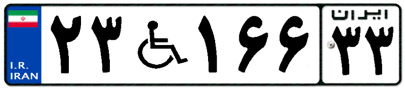</td>
            <td>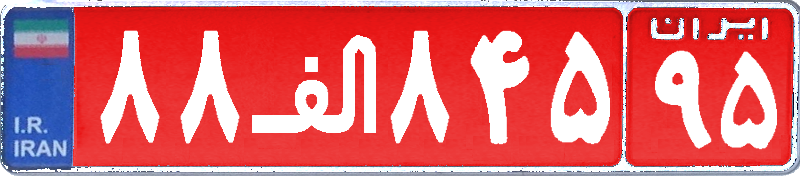</td>
        </tr>
    </table>
</body>
</html>

نمونه پلاک های تولید شده با پارامترهای (چرخش، تغییر پرسپکتیو، اشباع رنگ و غیره):


<html>
<body>
    <table>
        <tr>
            <td>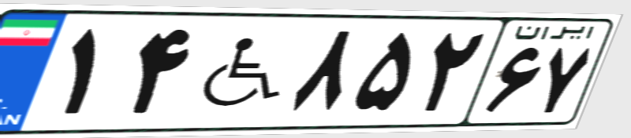</td>
            <td>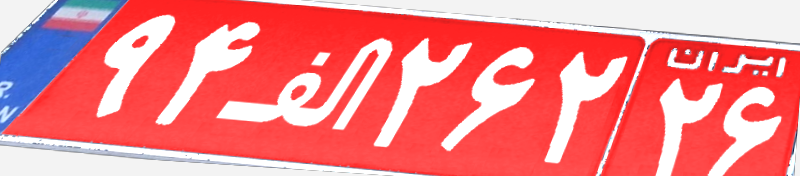 </td>
        </tr>
        <tr>
            <td>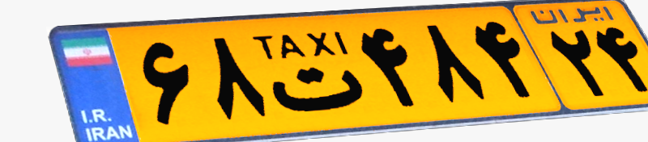</td>
            <td>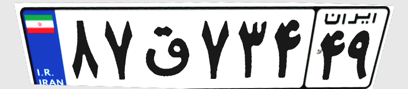</td>
        </tr>
        <tr>
            <td>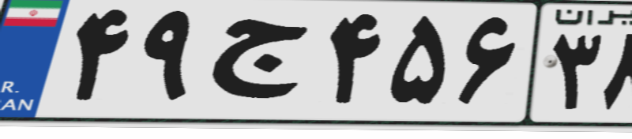</td>
            <td>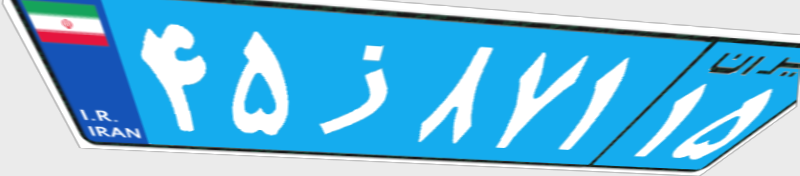</td>
        </tr>
    </table>
</body>
</html>

نمونه پلاک های تولید شده به همراه برچسب فرمت YOLO:


<html>
<body>
    <table>
        <tr>
            <td>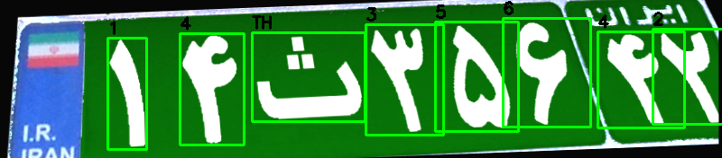</td>
            <td>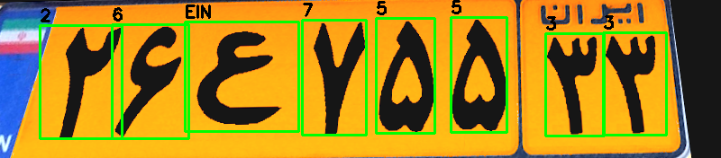 </td>
        </tr>
        <tr>
            <td>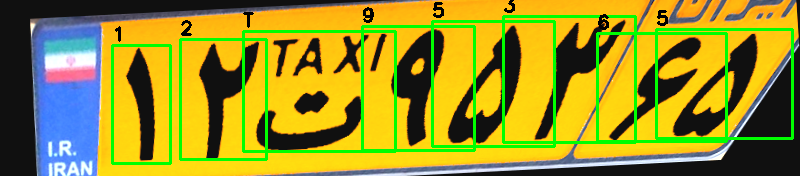</td>
            <td>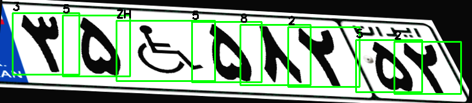</td>
        </tr>
        <tr>
            <td>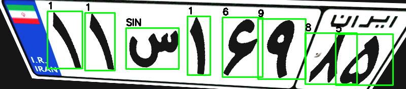</td>
            <td>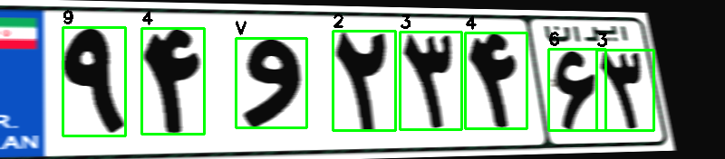</td>
        </tr>
    </table>
</body>
</html>

## How to use (Python 3.10.0 is recommended)

- ```
    pip install -r requirements.txt
    ```
- ```
    python main.py 
    ```

- With arguments (با پارامترهای چرخش، تغییر پرسپکتیو، اشباع رنگ و غیره):
- ```
    python main.py --num-images 100 --motion-blur-prob 0.3 --perspective-max-offset 0.12 --illumination-alpha-max 1.5
```

## Chars and Numbers

| Persian | English | Image | Persian | English | Image |
|----------|----------|----------|----------|----------|----------|
| 0 | 0 |  | ب | B |  |
| 1 | 1 |  | پ | P |  |
| 2 | 2 |  | ت | T |  |
| 3 | 3 |  | ج | J |  |
| 4 | 4 |  | ح | HE |  |
| 5 | 5 |  | د | D |  |
| 6 | 6 |  | س | SIN |  |
| 7 | 7 |  | ص | SAD |  |
| 8 | 8 |  | ط | TA |  |
| 9 | 9 |  | ع | EIN |  |
| ق | Q |  | ن | N |  
| م | M |  |و | V |  |
| ی | Y |  | ه | H |  |


## Label Mapping (راهنمای برچسب ها)

This dataset uses YOLO-format annotations.

Each label is encoded as:
<class_id> <x_center> <y_center> <width> <height>

### Class IDs

| ID | Label | Description |
|----|-------|------------|
| 0  | 0     | Digit zero (عدد صفر) |
| 1  | 1     | Digit one (عدد یک)|
| ...| ...   | ... |
| 9  | 9     | Digit nine (عدد نه) |
| 10 | A     | Government plate (دولتی)|
| 11 | P     | Police (پلیس)|
| 12 | T     | Taxi (تاکسی)|
| 13 | TH    | Sepah (سپاه)|
| 14 | Z     | Blue plate (دیپلمات)|
| 15 | SH    | Military (ارتش)|
| 16 | EIN   | Public (عمومی)|

- در کنار خروجی، راهنمای برچسب ها نیز اتماتیک ایجاد می شود