# Iranian-license-plate-generator

You can use this project to produce quality Iranian license plates.

از این پروژه برای تولید پلاک های ایرانی با کیفیت می توانید استفاده کنید.

## Samples


samples of generated images

نمونه پلاک های تولید شده

<html>
<body>
    <table>
        <tr>
            <td></td>
            <td> </td>
        </tr>
        <tr>
            <td></td>
            <td></td>
        </tr>
    </table>
</body>
</html>

## How to use

- ```
    pip install -r requirements.txt
    ```
- ```
    python main.py 
    ```

## Chars and Numbers

| Persian | English | Image | Persian | English | Image |
|----------|----------|----------|----------|----------|----------|
| 0 | 0 |  | ب | B | 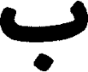 |
| 1 | 1 | 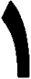 | پ | P |  |
| 2 | 2 |  | ت | T | 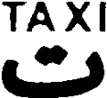 |
| 3 | 3 | 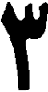 | ج | J |  |
| 4 | 4 | 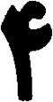 | ح | HE | 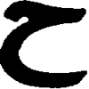 |
| 5 | 5 |  | د | D |  |
| 6 | 6 | 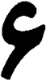 | س | SIN | 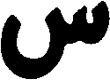 |
| 7 | 7 |  | ص | SAD |  |
| 8 | 8 | 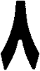 | ط | TA | 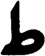 |
| 9 | 9 |  | ع | EIN |  |
| ق | Q | 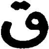 | ن | N | 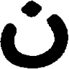 
| م | M |  |و | V |  |
| ی | Y |  | ه | H |  |


